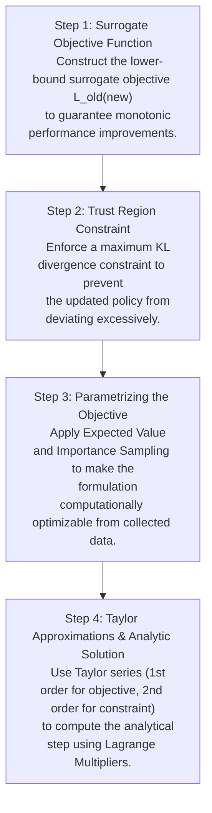

# Trust Region Policy Optimization (TRPO) — Lecture Notes

---

## 1. Introduction & Context

In reinforcement learning (RL) and modern policy optimization for reasoning systems, finding an optimal policy $\pi$ that maximizes expected cumulative rewards is a central challenge. This lecture develops the theoretical and practical foundations of **Trust Region Policy Optimization (TRPO)** from first principles.

TRPO addresses a fundamental instability in policy gradient methods: taking step updates in the policy parameter space ($\theta$) can lead to destructively large changes in the resulting policy's action distribution, permanently degrading the learning process. TRPO solves this by enforcing a mathematical constraint on the policy update step using the Kullback-Leibler (KL) divergence, ensuring updates remain within a safe "Trust Region."

---

## 2. Policy Performance and the Advantage Function

Let $\eta(\pi)$ represent the true performance measure (expected discounted return) of a policy $\pi$:

$$\eta(\pi) = \mathbb{E}_{s_0, a_0, \dots \sim \pi} \left[ \sum_{t=0}^{\infty} \gamma^t r(s_t, a_t) \right]$$

where $\gamma \in [0, 1)$ is the discount factor, and $r(s, a)$ is the reward function.

### 2.1 The Performance Difference Lemma
To find a policy $\pi_{\text{new}}$ that performs better than our current policy $\pi_{\text{old}}$, we analyze the difference in their performance. According to the Performance Difference Lemma (Kakade & Langford, 2002), the performance of a new policy $\pi_{\text{new}}$ can be written exactly in terms of the performance of the old policy $\pi_{\text{old}}$:

$$\eta(\pi_{\text{new}}) = \eta(\pi_{\text{old}}) + \sum_{s} \rho_{\pi_{\text{new}}}(s) \sum_{a} \pi_{\text{new}}(a|s) A_{\pi_{\text{old}}}(s,a)$$

#### Component Breakdown & Intuition:
*   **$\eta(\pi_{\text{old}})$**: The baseline performance of the current policy.
*   **$\rho_{\pi_{\text{new}}}(s)$**: The discounted state visitation frequency under the **new** policy, defined as:
    $$\rho_{\pi}(s) = \sum_{t=0}^{\infty} \gamma^t P(s_t = s | \pi)$$
*   **$A_{\pi_{\text{old}}}(s,a)$**: The advantage function under the old policy, which measures how much better action $a$ is compared to the average behavior of $\pi_{\text{old}}$ at state $s$:
    $$A_{\pi_{\text{old}}}(s, a) = Q_{\pi_{\text{old}}}(s, a) - V_{\pi_{\text{old}}}(s)$$

#### The Optimization Challenge:
We want to find a $\pi_{\text{new}}$ that maximizes the second term of the performance difference equation. However, the state visitation distribution $\rho_{\pi_{\text{new}}}(s)$ depends directly on the unknown, to-be-optimized policy $\pi_{\text{new}}$. This makes direct optimization mathematically intractable without running the new policy in the environment first.

---

## 3. The Surrogate Objective and Theoretical Lower Bound

To bypass the dependency on $\rho_{\pi_{\text{new}}}(s)$, we introduce a local approximation (or **surrogate objective**) $L_{\pi_{\text{old}}}(\pi_{\text{new}})$ by substituting the state visitation distribution of the old policy $\rho_{\pi_{\text{old}}}(s)$ in place of $\rho_{\pi_{\text{new}}}(s)$:

$$L_{\pi_{\text{old}}}(\pi_{\text{new}}) = \eta(\pi_{\text{old}}) + \sum_{s} \rho_{\pi_{\text{old}}}(s) \sum_{a} \pi_{\text{new}}(a|s) A_{\pi_{\text{old}}}(s, a)$$

### 3.1 Mathematical Properties of the Surrogate
When the new policy is identical to the old policy ($\pi_{\text{new}} = \pi_{\text{old}}$):
1.  **Match in Value**: 
    $$L_{\pi_{\text{old}}}(\pi_{\text{old}}) = \eta(\pi_{\text{old}})$$
    *(Since the sum of advantages under the target policy is zero: $\sum_a \pi(a|s)A_{\pi}(s,a) = 0$)*.
2.  **Match in First Derivatives**:
    $$\nabla_{\theta} \eta(\pi_{\theta}) \Big|_{\theta_{\text{old}}} = \nabla_{\theta} L_{\pi_{\theta_{\text{old}}}}(\pi_{\theta}) \Big|_{\theta_{\text{old}}}$$
    This means that for infinitesimally small steps around $\theta_{\text{old}}$, improving the surrogate $L$ guarantees an improvement in the true performance $\eta$.

### 3.2 Monotonic Improvement Bound
By employing the Minorization-Maximization (MM) algorithm framework, we can establish a theoretical lower bound. It can be mathematically proven that:

$$\eta(\pi_{\text{new}}) \ge L_{\pi_{\pi_{old}}}(\pi_{\text{new}}) - C D_{KL}^{\max}(\pi_{\pi_{old}}, \pi_{new})$$

Where:
*   $D_{KL}^{\max}(\pi_{\text{old}}, \pi_{\text{new}}) = \max_{s} D_{KL}(\pi_{\text{old}}(\cdot|s) \parallel \pi_{\text{new}}(\cdot|s))$
*   $C$ is a penalty constant determined by the environment transition dynamics and discount factor:
    $$C = \frac{2 \epsilon \gamma}{(1-\gamma)^2}$$
    with $\epsilon = \max_{s,a} |A_{\pi}(s,a)|$.

### 3.3 The Intuition behind the Trust Region
The lower-bound relationship can be visualized as follows:

```
  Performance
      ^
      |                 _--_  <- True Objective η(π)
      |                /    \
      |               /   x  \
      |   ...........*........\..............
      |  :          / :    \   \             :
      |  :         /  :     \   \            :
      |  :        /   :      \   \           :
      |  :       /    :       \__-\_         :  <- Surrogate Bound L(π) - C*DKL
      |  :      /     :             \        :
      +--:-----+------:--------------+-------> Policy Space (θ)
        θ_low        θ_old          θ_high
              |<--- Trust Region --->|
```

The surrogate bound (dashed curve) acts as a local conservative approximation. Maximizing this lower bound guarantees that the true performance $\eta(\pi)$ will also improve. 

However, in practice, the penalty coefficient $C$ is extremely large, leading to microscopic policy step updates. To allow the policy to make larger, practical updates while maintaining safety guarantees, TRPO reformulates the bound optimization as a **constrained optimization problem**, replacing the penalty term with a hard inequality constraint:

$$\max_{\pi_{\text{new}}} L_{\pi_{\text{old}}}(\pi_{\text{new}})$$

$$\text{subject to } D_{KL}^{\max}(\pi_{\text{old}}, \pi_{\text{new}}) \le \delta$$

Where $\delta$ represents the step size boundary (the trust region radius).

---

## 4. Simplifying the Objective via Expectations & Importance Sampling

To make the constrained optimization problem computationally tractable on sample trajectories, we simplify the surrogate objective using foundational probability concepts.

### 4.1 Concept 1: Expected Value
By definition, the expected value of a random variable $X$ under a probability distribution $P(x)$ is:

$$\mathbb{E}_{x \sim P}[x] = \sum_{x \in X} P(x) \cdot x$$

For a function of the random variable $f(x)$:

$$\mathbb{E}_{x \sim P}[f(x)] = \sum_{x \in X} P(x) \cdot f(x)$$

Using this identity, we can rewrite the state-visitation summation in the surrogate objective as an expectation over states sampled from the old policy's distribution $\rho_{\pi_{\text{old}}}(s)$:

$$\sum_{s} \rho_{\pi_{\text{old}}}(s) \left[ \sum_{a} \pi_{\text{new}}(a|s) A_{\pi_{\text{old}}}(s,a) \right] = \mathbb{E}_{s \sim \rho_{\pi_{\text{old}}}} \left[ \sum_{a} \pi_{\text{new}}(a|s) A_{\pi_{\text{old}}}(s, a) \right]$$

### 4.2 Concept 2: Constants in Maximization
If we optimize a function $X + C$ with respect to a parameter $\theta$, and $C$ does not depend on $\theta$, the parameter that maximizes the objective remains unchanged:

$$\arg\max_{\theta} [X(\theta) + C] = \arg\max_{\theta} X(\theta)$$

Let's expand the advantage term $A_{\pi_{\text{old}}}(s,a) = Q_{\pi_{\text{old}}}(s,a) - V_{\pi_{\text{old}}}(s)$:

$$\mathbb{E}_{s \sim \rho_{\pi_{\text{old}}}} \left[ \sum_{a} \pi_{\text{new}}(a|s) \left( Q_{\pi_{\text{old}}}(s,a) - V_{\pi_{\text{old}}}(s) \right) \right]$$

$$\mathbb{E}_{s \sim \rho_{\pi_{\text{old}}}} \left[ \sum_{a} \pi_{\text{new}}(a|s) Q_{\pi_{\text{old}}}(s,a) - V_{\pi_{\text{old}}}(s) \sum_{a} \pi_{\text{new}}(a|s) \right]$$

Since $\sum_{a} \pi_{\text{new}}(a|s) = 1$ (probabilities sum to 1):

$$\mathbb{E}_{s \sim \rho_{\pi_{\text{old}}}} \left[ \sum_{a} \pi_{\text{new}}(a|s) Q_{\pi_{\text{old}}}(s,a) \right] - \mathbb{E}_{s \sim \rho_{\pi_{\text{old}}}} \left[ V_{\pi_{\text{old}}}(s) \right]$$

The second term $\mathbb{E}_{s \sim \rho_{\pi_{\text{old}}}} \left[ V_{\pi_{\text{old}}}(s) \right]$ is fixed with respect to $\pi_{\text{new}}$. Thus, it acts as a constant during optimization and can be dropped, simplifying the objective to:

$$\mathbb{E}_{s \sim \rho_{\pi_{\text{old}}}} \left[ \sum_{a} \pi_{\text{new}}(a|s) Q_{\pi_{\text{old}}}(s,a) \right]$$

### 4.3 Concept 3: Importance Sampling
If we want to estimate the expectation of $f(x)$ under a target distribution $P(x)$, but we only have samples from a proposal distribution $Q(x)$, we can rewrite the expectation as:

$$\mathbb{E}_{x \sim P}[f(x)] = \sum_{x} P(x) f(x) = \sum_{x} Q(x) \frac{P(x)}{Q(x)} f(x) = \mathbb{E}_{x \sim Q}\left[ \frac{P(x)}{Q(x)} f(x) \right]$$

The ratio $\frac{P(x)}{Q(x)}$ acts as an **importance weight** to correct for the difference in sampling frequencies.

#### Application to Policy Optimization:
We want to evaluate the expectation under $\pi_{\text{new}}(a|s)$, but our collected trajectories (the historical dataset) are sampled from $\pi_{\text{old}}(a|s)$. Applying importance sampling to the action summation yields:

$$\sum_{a} \pi_{\text{new}}(a|s) Q_{\pi_{\text{old}}}(s,a) = \sum_{a} \pi_{\text{old}}(a|s) \frac{\pi_{\text{new}}(a|s)}{\pi_{\text{old}}(a|s)} Q_{\pi_{\text{old}}}(s,a) = \mathbb{E}_{a \sim \pi_{\text{old}}} \left[ \frac{\pi_{\text{new}}(a|s)}{\pi_{\text{old}}(a|s)} Q_{\pi_{\text{old}}}(s,a) \right]$$

Combining our state expectation and action expectation, the simplified objective to maximize is:

$$\max_{\pi_{\text{new}}} \mathbb{E}_{s \sim \rho_{\pi_{\text{old}}}, a \sim \pi_{\text{old}}} \left[ \frac{\pi_{\text{new}}(a|s)}{\pi_{\text{old}}(a|s)} Q_{\pi_{\text{old}}}(s, a) \right]$$

*(Note: In practice, replacing $Q_{\pi_{\text{old}}}$ back with $A_{\pi_{\text{old}}}$ is common because subtracting the baseline state-value reduces the variance of the sample estimator, without altering the analytical argmax).*

---

## 5. Mathematical Connection to Vanilla Policy Gradient

Let's represent the policies in parameterized form: $\pi_{\text{new}} \rightarrow \pi_{\theta}$ and $\pi_{\text{old}} \rightarrow \pi_{\theta_{\text{old}}}$. The objective function can be written as:

$$L_{\theta_{\text{old}}}(\theta) = \mathbb{E}_{s, a} \left[ \frac{\pi_{\theta}(a|s)}{\pi_{\theta_{\text{old}}}(a|s)} Q_{\theta_{\text{old}}}(s, a) \right]$$

Let's compute the gradient of $L_{\theta_{\text{old}}}(\theta)$ with respect to $\theta$, evaluated at $\theta = \theta_{\text{old}}$:

$$\nabla_{\theta} L_{\theta_{\text{old}}}(\theta) \Big|_{\theta = \theta_{\text{old}}} = \mathbb{E}_{s, a} \left[ \frac{\nabla_{\theta} \pi_{\theta}(a|s)}{\pi_{\theta_{\text{old}}}(a|s)} Q_{\theta_{\text{old}}}(s, a) \right] \Big|_{\theta = \theta_{\text{old}}}$$

$$\nabla_{\theta} L_{\theta_{\text{old}}}(\theta) \Big|_{\theta = \theta_{\text{old}}} = \mathbb{E}_{s, a} \left[ \frac{\nabla_{\theta} \pi_{\theta_{\text{old}}}(a|s)}{\pi_{\theta_{\text{old}}}(a|s)} Q_{\theta_{\text{old}}}(s, a) \right]$$

Using the standard log-derivative trick $\frac{\nabla_{\theta} \pi(a|s)}{\pi(a|s)} = \nabla_{\theta} \log \pi(a|s)$:

$$\nabla_{\theta} L_{\theta_{\text{old}}}(\theta) \Big|_{\theta = \theta_{\text{old}}} = \mathbb{E}_{s, a} \left[ \nabla_{\theta} \log \pi_{\theta_{\text{old}}}(a|s) Q_{\theta_{\text{old}}}(s, a) \right] = g$$

This is exactly the **Vanilla Policy Gradient** (VPG). This reveals that the first-order Taylor series approximation of our surrogate objective $L$ is mathematically equivalent to the standard policy gradient step.

---

## 6. Taylor Series Approximations for TRPO

To solve the constrained optimization problem efficiently, we approximate both the objective and the constraint around the current policy parameters $\theta_{\text{old}}$ using Taylor series expansions.

### 6.1 Objective Function Linear Approximation
Letting $x = \theta - \theta_{\text{old}}$ be the step vector, we approximate the objective function $f(\theta) = L_{\theta_{\text{old}}}(\theta)$ using its first-order Taylor expansion:

$$f(\theta) \approx f(\theta_{\text{old}}) + g^T (\theta - \theta_{\text{old}})$$

Since $f(\theta_{\text{old}}) = 0$ (as the advantage sum under the old policy is zero), this simplifies to:

$$f(\theta) \approx g^T (\theta - \theta_{\text{old}})$$

### 6.2 KL Constraint Quadratic Approximation
For the KL divergence constraint $d(\theta) = D_{KL}(\theta_{\text{old}} \parallel \theta)$, we use a second-order Taylor expansion.

The general second-order Taylor series of a function $d(\theta)$ around $\theta_{\text{old}}$ is:

$$d(\theta) \approx d(\theta_{\text{old}}) + \nabla_{\theta} d(\theta_{\text{old}})^T (\theta - \theta_{\text{old}}) + \frac{1}{2} (\theta - \theta_{\text{old}})^T \mathbf{H} (\theta - \theta_{\text{old}})$$

Where $\mathbf{H}$ is the Hessian matrix of second-order partial derivatives.

Let's evaluate each component for the KL divergence function $d(\theta) = D_{KL}(\theta_{\text{old}} \parallel \theta)$:
1.  **Zero-order term**: 
    $$d(\theta_{\text{old}}) = D_{KL}(\theta_{\text{old}} \parallel \theta_{\text{old}}) = 0$$
2.  **First-order term**: Since $D_{KL}(\theta_1 \parallel \theta_2) \ge 0$ with a global minimum of 0 when $\theta_1 = \theta_2$, the gradient of the KL divergence with respect to the second argument must be zero at $\theta = \theta_{\text{old}}$:
    $$\nabla_{\theta} d(\theta_{\text{old}}) = \mathbf{0}$$
3.  **Second-order term**: The Hessian matrix of the KL divergence evaluated at the identity point is the **Fisher Information Matrix** $\mathbf{A}$ (often denoted as $\mathbf{F}$):
    $$\mathbf{H} = \nabla_{\theta}^2 D_{KL}(\theta_{\text{old}} \parallel \theta) \Big|_{\theta = \theta_{\text{old}}} = \mathbf{A}$$

Substituting these values back into the second-order expansion yields:

$$D_{KL}(\theta_{\text{old}} \parallel \theta) \approx \frac{1}{2} (\theta - \theta_{\text{old}})^T \mathbf{A} (\theta - \theta_{\text{old}})$$

---

## 7. Deriving the Analytical Solution of TRPO

Using our approximations, we can state the local quadratic subproblem as:

$$\max_{\theta} g^T (\theta - \theta_{\text{old}})$$

$$\text{subject to } \frac{1}{2} (\theta - \theta_{\text{old}})^T \mathbf{A} (\theta - \theta_{\text{old}}) \le \delta$$

To solve this step-by-step from first principles, let $x = \theta - \theta_{\text{old}}$. The optimization problem becomes:

$$\max_{x} g^T x \quad \text{subject to } \quad \frac{1}{2} x^T \mathbf{A} x \le \delta$$

### 7.1 Lagrangian Formulation
We formulate the Lagrangian function by introducing a Lagrange multiplier $\lambda \ge 0$ for the inequality constraint:

$$\mathcal{L}(x, \lambda) = g^T x - \lambda \left( \frac{1}{2} x^T \mathbf{A} x - \delta \right)$$

To find the optimal step $x^*$, we take the derivative of $\mathcal{L}$ with respect to $x$ and set it to zero:

$$\nabla_x \mathcal{L}(x, \lambda) = g - \lambda \mathbf{A} x = 0$$

$$\lambda \mathbf{A} x = g$$

$$x^* = \frac{1}{\lambda} \mathbf{A}^{-1} g$$

### 7.2 Solving for the Lagrange Multiplier $\lambda$
Since we want to maximize our objective along the gradient direction, the optimal step must lie on the boundary of our trust region constraint. We substitute our expression for $x^*$ back into the equality boundary constraint:

$$\frac{1}{2} (x^*)^T \mathbf{A} (x^*) = \delta$$

$$\frac{1}{2} \left( \frac{1}{\lambda} \mathbf{A}^{-1} g \right)^T \mathbf{A} \left( \frac{1}{\lambda} \mathbf{A}^{-1} g \right) = \delta$$

$$\frac{1}{2 \lambda^2} g^T \mathbf{A}^{-1} \mathbf{A} \mathbf{A}^{-1} g = \delta$$

$$\frac{1}{2 \lambda^2} g^T \mathbf{A}^{-1} g = \delta$$

$$\lambda^2 = \frac{g^T \mathbf{A}^{-1} g}{2 \delta}$$

$$\lambda = \sqrt{\frac{g^T \mathbf{A}^{-1} g}{2 \delta}}$$

### 7.3 Final Step Calculation
We substitute $\lambda$ back into the optimal step equation:

$$x^* = \sqrt{\frac{2 \delta}{g^T \mathbf{A}^{-1} g}} \mathbf{A}^{-1} g$$

Thus, the analytical update formula for the policy parameters is:

$$\theta_{k+1} = \theta_k + \sqrt{\frac{2 \delta}{g^T \mathbf{A}^{-1} g}} \mathbf{A}^{-1} g$$

### 7.4 Line Search and Constraint Satisfaction
Because our approximations (first-order for objective, second-order for KL constraint) are only locally valid, the theoretical update step can sometimes violate the non-linear KL constraint or fail to improve the surrogate objective. To guarantee monotonic improvement, TRPO uses a backtracking line search:

$$\theta_{k+1} = \theta_k + \alpha^j \sqrt{\frac{2 \delta}{g^T \mathbf{A}^{-1} g}} \mathbf{A}^{-1} g$$

where $\alpha \in (0, 1)$ is a decay factor and $j \in \{0, 1, 2, \dots\}$ is the smallest integer such that the updated parameters satisfy the original non-linear constraints and provide a performance improvement.

---

## 8. Computational Bottlenecks and Transition to PPO

While TRPO offers strong theoretical guarantees of monotonic policy improvement, it suffers from a significant computational bottleneck.

### 8.1 The Matrix Inversion Problem
The step calculation requires computing $\mathbf{A}^{-1} g$. The Fisher Information Matrix $\mathbf{A}$ has dimensions $N \times N$, where $N$ is the number of policy parameters. For modern neural networks where $N$ can range from millions to billions of parameters:
*   **Storage**: Storing $\mathbf{A}$ requires $O(N^2)$ memory, which is computationally prohibitive.
*   **Inversion**: Solving $\mathbf{A}^{-1} g$ directly or inverting $\mathbf{A}$ requires $O(N^3)$ computational complexity.

### 8.2 The Conjugate Gradient Method
To scale TRPO, researchers use the **Conjugate Gradient (CG)** algorithm to approximate the vector $y = \mathbf{A}^{-1} g$ (which is equivalent to solving the linear system $\mathbf{A} y = g$). CG only requires computing matrix-vector products of the form $\mathbf{A} v$. This can be computed efficiently in $O(N)$ time without explicitly storing $\mathbf{A}$ by using Hessian-vector product tricks (Pearlmutter's trick).

### 8.3 The Motivation for PPO
Despite the CG approximation, TRPO remains complex, mathematically intensive, and difficult to implement across different model architectures. This bottleneck directly motivated the creation of **Proximal Policy Optimization (PPO)**. PPO approximates the trust-region constraint by modifying the objective function with a clipping mechanism, allowing policy updates using simpler, first-order stochastic gradient descent (SGD) algorithms.

---

## 9. Comprehensive Summary of the TRPO Pipeline

TRPO's mathematical framework can be summarized in four sequential steps:

